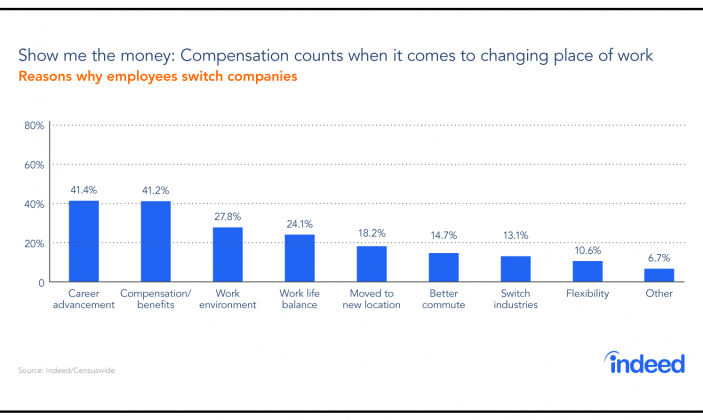

\pagebreak

```{r echo=FALSE, message=FALSE, warning=FALSE}
# if package is not installed, use install.packages("library_name") to install
library(dplyr)
library(ggplot2)
library(gridExtra)
library(corrgram)
library(knitr)
library(visreg)
library(stargazer)
library(oddsratio)
```

# Introduction

## The Attrition Problem 
The competition for employers to acquire and retain talent is just as furious as that for candidates to get into an organization. Moreover, employers have to bare the different costs associated with employee attrition. Example cost implications are the costs required to recruit a new person to cover the role, the man-hours, or wage, lost due to lower efficiency of new recruits, and training costs. An article on the Robert Half website estimated that it takes on average 28 days to recruit for an open position @robertHalf. In some cases, it might even takes months before the human resources (HR) team can hire someone suitable to fill the gap. According to Schawbel, “The biggest priority, and concern, for business leaders in 2017 will be retaining employees in a competitive talent marketplace.” @fortuneEmployersWorry 

### Importance of Retention
Retention is growingly concerning for organizations in the private and public sector. Recently the NHS announced a million-pound spending to drive recruitment @churchillKnight. Employees come and go is becoming an inevitable trend in Europe and the US. Whilst it may benefit the employees, it undoubtedly levied considerable costs on the employers. Research from Bersin Deloitte reported that the talent acquisition spending of US companies increased by 7% on average from 2013 to $4000 per hire in 2014 @Cision. As recruiters struggle, many reach out to consultancies for help. Consultancy.uk revealed that the HR consulting market grew by 4.8% from 2014 to 2015. It can be seen that increasing retention is important @ConsultancyUK. Hence, we are exploring an HR data set to analyze variables that can affect attrition. 
 
 
### Increasing Retention 

To improve retention, it is necessary to know the influencers of it. There are many factors that can influence employees’ decision on whether to leave the company or not. Obvious ones are financial reward per unit time contributed, benefits and working hours. Depending on what the job entails and the individual, other influencers could include working environment, distance from home, the amount of travelling required, relationship with colleagues, sense of achievement, autonomy, personal development. 

 

Indeed.com, an American job search engine, published a report on job tenure showed that career advancement and compensation are by far the leading reasons for changing companies, followed by work environment and work life balance @indeedJobTenure.


## Report Objective
We would like to test whether the above is true from the dataset we obtained from Kaggle, a data-related website. More broadly, we would like to help companies retain their valuable employees. To do this, there are two problems to solve. Firstly, identify the most impactful influencers. Secondly, produce a model that can give the likelihood of an employee leaving. The model will highlight to the company who they risk losing. Then the employer can put in extra effort into preventing the high risk employees from leaving. 

# Method

According to the two objectives, the analysis will start with plotting and observing the distribution of the different variables. By observation, discrepancy between the distribution of employees who left and those who haven't is a hint that the variable is an attrition influencer. Hypothesizing that the variable is related to attrition, a hypothesis test can be conducted to determine the significance of the relationship. Lastly, regression models can be compiled to predict attrition and to explore the influencer’s contribution to the likelihood of leave. 

## About the Data Set- Descriptive Statistics
```{r echo=FALSE, message=FALSE, warning=FALSE}
IBM <- read.csv("WA_Fn-UseC_-HR-Employee-Attrition.csv")
colnames(IBM)[1] <- "Age"  # correct faulty column name of the first column

# columns such as employee number are not relevant or where all entries are the same, keep only relevant columns with varying inputs
IBM <- select(IBM, Age:EducationField, EnvironmentSatisfaction:NumCompaniesWorked, OverTime:RelationshipSatisfaction, StockOptionLevel:YearsWithCurrManager)
```

This is a cross-sectional dataset of survey answers and objective information regarding the employees of IBM. It has a total of 1470 observations (employees) across 35 variables (information about the employee). The variables can be boardly divided into three groups: personal information, job specific information, and subjective ratings. 

In our analysis, the colomns EmployeeCount and EmployeeNumber are not useful, and the value in Over18 and StandardHour are the same with all employees (Yes and 80 respectively), so we filtered out these four colomns to make our analysis more efficient. 

```{r, echo=FALSE}
#Converting variables into Factor Variables
IBM$Education<-ordered(IBM$Education,levels=c("1","2","3","4","5"))
IBM$JobSatisfaction<-ordered(IBM$JobSatisfaction,levels=c("1","2","3","4"))
IBM$JobLevel<-ordered(IBM$JobLevel,levels=c("1","2","3","4"))
IBM$JobInvolvement<-ordered(IBM$JobInvolvement,levels=c("1","2","3","4"))
IBM$StockOptionLevel<-ordered(IBM$StockOptionLevel,levels=c("0","1","2","3"))
IBM$RelationshipSatisfaction<-ordered(IBM$RelationshipSatisfaction,levels=c("1","2","3","4"))
IBM$WorkLifeBalance<-ordered(IBM$WorkLifeBalance,levels=c("1","2","3","4"))

```

In addition, the dataset has inputs that a meant to be factors or levels but are logged as integers. For example, the Education colomn uses integer between 1 to 5 to refer to the level of education of this employee. The numbers respectively means 'below college', 'college', 'bachelor', 'master' and 'doctor'. To catogrize the education level, we change the integers incicating the education level into factors. The same approach was taken for similar variables, including 'JobLevel', 'StockOptionLevel' and 'TrainingTimeLastYear'. 

Variables related to employee personal information are shown in the following table. 

```{r echo=FALSE, message=FALSE, warning=FALSE}

personal <- data.frame(Variable=c("Age", "DistanceFromHome", "Education",
                                   "EducationField", "Gender", "MaritalStatus",
                                   "NumCompaniesWorked","TotalWorkingYears"),
                       Type=c("integer","integer","factor","factor","factor","factor","integer","integer"),
                       Description=c("The Employee's age", 
                                     "The distance from home to work", 
                                     "Level of education (1 'Below College', 2 'College', 3 'Bachelor', 4 'Master', 5 'Doctor')",
                                     "The subject of the employee's education (Human Resources, Life Sciences, Marketing, Medical, Other, Technical Degree)", 
                                     "Gender of this employee", "Marital status of this employee (Divorced, Married, Single)",
                                     "The number of companies this employee has worked", "Total number of years this employee has worked since graduation"))

kable(personal, caption = "Personal Information")
```

Variables relating to the employee's job at the company includes the following. 

```{r echo=FALSE, message=FALSE, warning=FALSE}

jobinfo <- data.frame(Variable=c("Attrition","BusinessTravel","DailyRate","Department","HourlyRate","JobInvolvement",
                                 "JobLevel","JobRole", "MonthlyIncome", "MonthlyRate", "OverTime", "PercentSalaryHike",
                                 "PerformanceRating","StockOptionLevel", "TrainingTimesLastYear","YearsAtCompany",
                                 "YearsInCurrentRole", "YearsSinceLastPromotion","YearsWithCurrManager"),
                      Type=c("factor","factor","integer","factor","integer","factor","factor","factor","integer","integer",
                             "factor","integer","integer","factor","factor","integer","integer","integer","integer"),
                      Description=c("If this employee left the company", "The frquency of business travel", "sth", 
                                    "The department of this employee (Human Resource, Research & Development and Sales)","sth","1 'Low', 2 'Medium', 3 'High', 4 'Very High'","The level of this employee's job","The position of this employee (Sales Executive, Research Scientist, Laboratory Technician, Manufacturing Director, Healthcare Representative, Manager, (Other))", "The salary of this employee","sth", "If this employee works over time (Yes, No)", "The percentage of salary hike", "1 'Low', 2 'Good', 3 'Excellent', 4 'Outstanding'", "The amount of stock this employee process", "The length of training the employee took last year", "The number of years this employee has been in the company", "The number of years this employee has been in this position","The number of years since last promotion", "The number of years this employee has been with current manager"))

kable(jobinfo, caption = "Job Information")
```

Lastly, subjective ratings that are possibly obtained from a survey are captured by the following variables. 

```{r echo=FALSE, message=FALSE, warning=FALSE}
totals <- data.frame(Variable=c("EnvironmentSatisfaction","JobSatisfaction","RelationshipSatisfaction","WorkLifeBalance"),
                     Type=c("factor","factor","factor","factor"),
                     Description=c("Satisfaction to the environment (1 'Low', 2 'Medium', 3 'High', 4 'Very High')",
                                   "Satisfaction to the job (1 'Low', 2 'Medium', 3 'High', 4 'Very High')",
                                   "Satisfaction to the relationship (1 'Low', 2 'Medium', 3 'High', 4 'Very High')",
                                   "The work life balance rate (1 'Bad', 2 'Good', 3 'Better', 4 'Best')"))

kable(totals, caption = "Satisfaction to the Job in Total")
```

This dataset covered 1470 employees and according to the pie chart, male make up 2/3 of the total employees.

```{r echo=FALSE, message=FALSE, warning=FALSE}
ggplot(IBM, aes(x = factor(""), fill = Gender))+geom_bar()+coord_polar(theta = "y")+labs(title = "Gender Distribution")+scale_x_discrete("")
```

It includes information about employees from 3 different departments in 7 different roles. Two thirds of the recorded employees are from the Research & Development department, employees from Sales took up most of the remaining part. Only 63 employees recorded were from Human Resources department. Apart from the "Manager" role, each role corresponds to a specific department. Therefore, when we do regression analysis on attrition, we will need to consider the interdependency between roles and deparment. 

```{r echo=FALSE}
ggplot(IBM,aes(JobRole, fill=Department))+geom_bar(position="dodge")+theme(axis.text = element_text(angle = 45,hjust = 1))
```

The graph demonstrates that managers are the odd one out in this data set. There is a very small number of managers and the manager role is the only cross-department role. To reduce noise and increase chances of dicovering trends, data related to the manager role is filtered out during analysis. 

Before filtering, the attrition rate for managers and non-managers were investigated. It is found that amongst survey managers only 4.9% left the company compared to 16.1% for employees in non-manager roles. Further supporting the assumption that manager is a very different group compared to non-mangers. 

A report done by indeed.com showed that one of the most impactful contributor to attrition is compensation. Hence two graphs are ploted to show the distribution of monthly income. Most employees got salaries between 2500 and 7500. Apart from managers, Research Director has the highest monthly income with an average at 16034, Healthcare Representative, Manufacturing Director and Sales Executive earned half as much as Research Director (7528.763, 7295.138 and 6924.279 on average respectively), and employees in other roles got less.
```{r echo=FALSE}
sal1 <- ggplot(IBM,aes(MonthlyIncome))+geom_density()
#ggplot(IBM,aes("" ,MonthlyIncome))+geom_boxplot()
sal2 <- ggplot(IBM,aes(JobRole,MonthlyIncome))+geom_boxplot()+theme(axis.text = element_text(angle = 45,hjust = 1))
grid.arrange(sal1,sal2, ncol=2)
#mean(IBM[IBM[,"JobRole"]=="Research Director","MonthlyIncome"])
#mean(IBM[IBM[,"JobRole"]=="Healthcare Representative","MonthlyIncome"])
#mean(IBM[IBM[,"JobRole"]=="Sales Executive","MonthlyIncome"])
```

## Strength and Limitations
This dataset contains information of employees that stayed and of those who left. It allows us to compare and reveal difference in trend between those who decided to leave and those who stayed. The dataset covered 3 main departments and 7 job roles in IBM and it also contain each employee’s personal information and his job information. The detailed information enables us to augment the analysis.

However, this dataset has some limitations. It didn’t specify what DailyRate, HourlyRate, Monthly Rate mean. As a result, our team can not give suggestions even if we found that it affects attrition. Secondly, this dataset only covered 1470 employees, which is not large enough to produce an extremely persuasive result. Moreover, technically we can only narrow down to which factors are related to attrition. With cross-sectional data it is hard to prove causalty. Lastly, the variables EnvironmentSatisfaction, JobSatisfaction, RelationshipSatisfaction and WorkLifeBalance are categorical, which requires a different type of regression compared to the standard linear regression taught in the lectures.

# Analysis


```{r, echo=FALSE}
#Converting variables into Factor Variables
IBM$Education<-ordered(IBM$Education,levels=c("1","2","3","4","5"))
IBM$JobSatisfaction<-ordered(IBM$JobSatisfaction,levels=c("1","2","3","4"))
IBM$JobLevel<-ordered(IBM$JobLevel,levels=c("1","2","3","4"))
IBM$JobInvolvement<-ordered(IBM$JobInvolvement,levels=c("1","2","3","4"))
IBM$StockOptionLevel<-ordered(IBM$StockOptionLevel,levels=c("0","1","2","3"))
IBM$RelationshipSatisfaction<-ordered(IBM$RelationshipSatisfaction,levels=c("1","2","3","4"))
IBM$WorkLifeBalance<-ordered(IBM$WorkLifeBalance,levels=c("1","2","3","4"))


IBM <- filter(IBM, JobRole!="Manager")

```

## Distribution With Respect to Attrition
In this section, the distribution of the different variable are plotted and observed. The aim is to discover discrepancies between the employees that left the company, which has 'yes' in the 'Attrition column'. 

### Overall
```{r distributionPlots, echo=FALSE,message=FALSE}
p_train<-ggplot(IBM,aes(x=TrainingTimesLastYear,fill=Attrition))+geom_bar(position="fill")
p_jsat<-ggplot(IBM,aes(x=JobSatisfaction,fill=Attrition))+geom_bar(position="fill")
p_role<-ggplot(IBM,aes(x=JobRole,fill=Attrition))+geom_bar(position="fill")+theme(axis.text = element_text(angle = 45,hjust = 1))
p_income<-ggplot(IBM,aes(x=MonthlyIncome,fill=Attrition))+geom_histogram(position="fill", binwidth=2500)
p_years<-ggplot(IBM,aes(x=YearsAtCompany,fill=Attrition))+geom_density(adjust=1.5, position="fill")
p_yrpromo<-ggplot(IBM,aes(x=YearsSinceLastPromotion,fill=Attrition))+geom_bar(position="fill")
p_biztrav<-ggplot(IBM,aes(x=BusinessTravel,fill=Attrition))+geom_bar(position="fill")
p_wlbalance<-ggplot(IBM,aes(x=WorkLifeBalance,fill=Attrition))+geom_bar(position="fill")
grid.arrange(p_train, p_jsat, p_role, p_income, ncol=2)
```

**Effect of trainings**
The bar chart for training times shows a rough decreasing trend. In general, more training leads to fewer leaves. However, more than 75 percent of employees stayed at the company despite no training last year. 

**Effect of job satisfaction**
Similar to traing time, JobSatisfaction is also a factor that influece people's decision on whether to leave or not. As job satisfaction increases from 1 to 4, the percentage of attrition decreases from 24% to 10%, which indicates improving job satisfaction may help prevent employees from leaving the company.

**Percentage leave with respect to job role**
Based on the above bar chart, it can be concluded that Research & Development department is the most stable department with only around 14% of employees leaving, while the proporion in Sales and Human Resources Departments are about 10% higher than it.We can mainly focus on this two departments' analysis if the company do not have enough money for improvement.

**Effect of income**
As we can see from this density plot on monthly income, it is highly right skewed, which implies most employees' incomes are aound 2500 per month. There is a sharp decrease after the peak reached at 2500, additionally, the density of employees who choose to leave is higher than who want stay when their salary are lower than 4000($). 

**Effect of years spent at the company**
In term of years employees have stayed at company, the percentage of attrition smoothly goes down during the first 20 years.However, in the following 20 years, it then inscreases to around 90 percent with fluctuations in between. To sum up, People are more likely to leave the company during the first few years or after staying for more than 30 years.

** Effect of promotion**
The bar chart above shows there is no significant relationship between years since last promotion and the attrition. The propotion for leaving fluctuates around 20 percent.Two special years occur at year 8 and 12 with no attrion.

**Effect of business travel **
In this business travel bar chart, only 8 percent of employees want to leave company if they are in non-travel roles, but high attrition occurs at about 25 percent when they need travel frequently, which indicates that business travel may have positive impact on company's attrition.


**Effect of work life balance**
In terms of work life balance, around 30 percent of employees choose to leave the company if they have a bad balance. However with the level increases to 2 and more, the attrition percentage drops dramatically to half of level 1. Therefore, improvement of work life balance can also be a significant factor.


### Conclusion for Graphical Analysis

So far we have plotted eight graphs aiming to find out the relationship between attrition and each other variables. From the analysis above, we can see JobSatisfaction, BusinessTravel and WorkLifeBalance are three most significant factors that have strong impact on employees attrition choices. 

However, since JobSatisfaction (distrete) and WorkLifeBalance (discrete) are all subset of TotalSatisfaction, we can combined them together as a combined satisfaction (continues variable) and continue exploring which factors affect them through correlation test, in order to find out potential variables that indirectly affect attriton.


## Hypothesis Test 

As stated in the previous analysis part, in this correlation part, we will continue exploring the relationship between combined satisfaction (JobSatisFaction & WorkLifeBalance) and other variables, seeking potential indirect fators contributed to employees' attrition choices.

First, we create a correlation table which creates a general idea on all correlations and we will then select potential variable for further correlation tests.

```{r,out.width="100%",fig.align="center",echo=FALSE,message=FALSE, eval=FALSE, fig.align="center", message=FALSE, include=FALSE, out.width="100%"}
#Comment by Avi - There is an error in combined_satisfaction (Please check)

IBM <-mutate(IBM,combined_satisfaction =JobSatisfaction+WorkLifeBalance)
new_IBM<-select(IBM,-(Attrition),-(BusinessTravel),-(Department),-(EducationField),-(Gender),-(JobRole),-(MaritalStatus),-(OverTime),-(EnvironmentSatisfaction),-(JobSatisfaction),-(WorkLifeBalance),-(TotalSatisfaction),-(RelationshipSatisfaction),-(JobLevel))

library(corrgram)
corrgram(new_IBM,main="Correlogram of IBM data set")

```

In the correlogram, the darker shade implies the higher correlation with each other. The last line indicates all correlations among combined satisfactions and other variables. The factors (with darker shade) need to be inspected and the potential resaons for selecting them are listed below.
```{r,echo=FALSE,message=FALSE}
library(knitr)
Variables<-c("MonthlyIncome","PercentSalaryHike","PerformanceRating","TrainingTimesLastYear","YearsInCurrentRole")
Reasons<-c("Money might be the most direct reason for job satisfaction",
           "Consider about furture development, people may be more happy with high Percent Salary Hike",
           "Motivations for work might decrease due to lower performance rating",
           "Longer training time could be helpful on employees' self-improvement",
           "Long time for repeating the same task might decrease the interest on work")
a<-data.frame(Variables,Reasons)

knitr::kable(a)

```


##1) Monthly Income
```{r, eval=FALSE, include=FALSE}
#Comment by Avi - There is an error in combined_satisfaction (Please check)
cor.test(IBM[,"MonthlyIncome"],IBM[,"combined_satisfaction"])
```

```{r,echo=FALSE,message=FALSE}
Test_statistic<-round(0.40687,4)
df<-1468
P_value<-0.6842
Correlation<-round(0.01061867   ,4)
corr<-data.frame(Test_statistic,df,P_value,Correlation)
library(knitr)
knitr::kable(corr,caption="Summary")
##The table may not be seen on R markdown here, but can be seen when knited!
```

As shown above, the correlation between Monthly Income and combined satisfaction are around 0.01, there is little relationship between them.However, the increase on monthly income doesn't influence that much as what we expected before. High P-value (around 0.68) indicates monthly income may not be a significant factor for combined satisfaction.

### Percent Salary Hike

```{r,echo=FALSE,message=FALSE, eval=FALSE, message=FALSE, include=FALSE}
#Comment by Avi - There is an error in combined_satisfaction (Please check)
cor.test(IBM[,"PercentSalaryHike"],IBM[,"combined_satisfaction"])
```


```{r,echo=FALSE,message=FALSE}
Test_statistic<-round(0.58278,4)
df<-1468
P_value<-0.5601
Correlation<-round(0.01520856  ,4)
corr<-data.frame(Test_statistic,df,P_value,Correlation)
library(knitr)
knitr::kable(corr,caption="Summary")
```

Similar to the previous test, it can be observed that combined satisafaction is possitively but weakly connected with distance from home. In this case, increasing on percent salary hike may have no impact on changing employee's satisfaction.


##3) Performance Rating
```{r,echo=FALSE,message=FALSE, eval=FALSE, message=FALSE, include=FALSE}
#Comment by Avi - There is an error in combined_satisfaction (Please check)
cor.test(IBM[,"PerformanceRating"],IBM[,"combined_satisfaction"])
```


```{r,echo=FALSE,message=FALSE}
Test_statistic<-round( 0.12842,4)
df<-1468
P_value<-0.8978
Correlation<-round(0.003351649 ,4)
corr<-data.frame(Test_statistic,df,P_value,Correlation)
library(knitr)
knitr::kable(corr,caption="Summary")
```

With correlation value close to zero and 0.89 p-value, we can conclude that there is strongly evidence to reject performance rating as one of the variables for affecting attrition.


##4) Training Times Last Year
```{r,echo=FALSE,message=FALSE, eval=FALSE, message=FALSE, include=FALSE}
#Comment by Avi - There is an error in combined_satisfaction (Please check)
cor.test(IBM[,"TrainingTimesLastYear"],IBM[,"combined_satisfaction"])
```

```{r,echo=FALSE,message=FALSE}
Test_statistic<-round(0.39726,4)
df<-1468
P_value<-0.6912
Correlation<-round(0.01036796 ,4)
corr<-data.frame(Test_statistic,df,P_value,Correlation)
library(knitr)
knitr::kable(corr,caption="Summary")
```

Similar as the privous factor, with 0.01 correlation value, increasing on traning time per year still does not have significant impact on combined satisfaction.


##5) Years In Current Role
```{r,echo=FALSE,message=FALSE, eval=FALSE, message=FALSE, include=FALSE}
#Comment by Avi - There is an error in combined_satisfaction (Please check)

cor.test(IBM[,"YearsInCurrentRole"],IBM[,"combined_satisfaction"])
```

```{r,echo=FALSE,message=FALSE}
Test_statistic<-round(0.9649,4)
df<-1468
P_value<-0.3348
Correlation<-round(0.02517577,4)
corr<-data.frame(Test_statistic,df,P_value,Correlation)
library(knitr)
knitr::kable(corr,caption="Summary")
```

Compared with other factors tested above, years in current role shows stronger positive correlation with combined satisfaction, which implies the longer employees working on the same role the higher satisfaction they have. 

### Conclusion for the correlation test
As we can see from the above correlation test, years in current role is more relative with combined satisafaction(JobSatisFaction & WorkLifeBalance) compared with others. This implies years in current role may be an indirect variable contributing to employees' attrition choice. However, its correlation value is still not very significant. Therefore the linear regression might not give the a suitable approximation, it may be an approriate choice to apply another regression methods.


# Analysis


## Proportion Test
```{r}
prop.test(table(IBM[,"Gender"], IBM[,"Attrition"]), alternative = "greater")
```
The proportion of female staying in the company is 85.20% The proportion of male who stay in the company is 82.00%. So the proportion of male and female who stay in the company is the same according to the proportion test.

# Hypothesis Tests. Cannot Use t-tests as our independent variable is not continuous. Instead, we use regression analysis to determine whether or not the variable is statistically significant.

#First, regressing Attrition on department. Not statistically significant

```{r}
#NOT SURE ABOUT THIS SECTION - Comment by Avi - I have rewritten it !
```

Regression Analysis.

The motivation for the following model is to provide the company with a clear indication of the factors significantly contributing to an employee leaving the company. We will then split the model into two: one for those factors the company can directly influence in order to decrease its attrition rate, the other outlaying those which are of a more personal nature and where the company has limited scope for interference. That is not to say that those findings have no value, though. The information uncovered here provides the company with a broad insight into the morale across the demographics of its workforce and could provide motivation for the design of programmes or events that subtly engage those with a higher probability of leaving the job.

Hence, we propose a model which treats Attrition as the dependent, or explanatory, variable. Our earlier analysis describes Attrition as a categorical variable and for this reason we used the method of logistic regression to build the model. This method provides the percentage chance of an event occuring, where '1' is coded to mean there is a high chance that the employee will leave and '0' means the opposite. We use the particular method of logit smoothing to restrict our output between these levels. Incidentally, this also serves as a basis for a scale on which to compare the probability of individual employees leaving. For instance, if the company wanted to know the reasons behind people of or over a certain age leaving the company, then, controlling for age, it is possible to compare whether one employee is likely to leave over another based on their other key characteristics. From here, the company can direct effort into those areas to improve the chances of that employee choosing to stay at the company. 

The process and logic of determining the model is such. First, we use a maximum-likelihood estimation (MLE) to quantify the effect of any particular variable on the probablity of an employee leaving the company. It must be noted that MLE assumes an aspymtotically normal distribution and thus invokes the use of the Wald statistic to test whether or not that particular variable's effect is statistically significant: our null hypothesis is always that the variable has no effect. We set a 95% confidence interval for the model. If the Wald statistic is deemed to be more extreme than this level, then the null hypothesis is rejected and we accept that the alternative hypothesis that there is a statistically significant relationship between those two variables; that the independent variable goes some way in explaining the probablity that an employee leaves. The z-value is then called and calculated to provide the probablilty that the null hypothesis is true in a value named the p-value. If the p-value is below 5% then we reject the null hypothesis.

z score to compute the p value
mean = E(Y)=np
var = np(1-p)


Wald test
z-test

```{r}
Unsure section ends 
```


```{r}
att_1 <- glm(formula = Attrition ~ Department, data = IBM, family=binomial)
#z.test(x, y = DistanceFromHome, Attrition) #Can't figure out
summary(att_1)
```

#Second, regressing Attrition on DistanceFromHome
att_2 <- glm(formula = Attrition ~ DistanceFromHome, data = IBM, family=binomial)
summary(att_2)

#Third, regressing Education on Attrition (NOT DONE YET)
att_3 <- glm(formula = Attrition ~ CONVERTEducation, data = IBM, family=binomial)
summary(att_3)

#Fourth, regressing Age on Attrition
att_4 <- glm(formula = Attrition ~ Age, data = IBM, family=binomial)
summary(att_4)

#Fifth, regressing Hourly Rate on Attrition. Not statistically significant
att_5 <- glm(formula = Attrition ~ HourlyRate, data = IBM, family=binomial)
summary(att_1)

#Sixth, regressing Monthly Income on Attrition.
att_6 <- glm(formula = Attrition ~ MonthlyIncome, data = IBM, family=binomial)
summary(att_6)

#Seventh, regressing YearsAtCompany on Attrition
att_7 <- glm(formula = Attrition ~ YearsAtCompany, data = IBM, family=binomial)
summary(att_7)

#Eighth, regressing PercentSalaryHike on Attrition
att_8 <- glm(formula = Attrition ~ PercentSalaryHike, data = IBM, family=binomial)
summary(att_1)

#Nine, regressing NumCompaniesWorked on Attrition. Not statistically significant.
att_9 <- glm(formula = Attrition ~ NumCompaniesWorked, data = IBM, family=binomial)
summary(att_1)

#Something.
tot_sat_11 <- glm(formula = Attrition ~ YearsAtCompany, data = IBM, family=binomial)
summary(att_1)


##Regression Analysis


This report is making use of the logit regression model in order to analyse the impact several variables have on an individual's odds for leaving the company. This analysis is initiated by looking at two models: one for those factors the company can directly influence in order to decrease its attrition rate, the other outlaying those which are of a more personal nature and where the company has limited scope for interference. This is then followed by a model which only takes into consideration the performance indicators of an individual. These models allows the study to take into consideration the nature of different variables. This is finally followed by a full analysis model which has all the variables. The full model adds to the robustness of the results which are presented beforehand. 

Since this study makes use of a logit model, the coefficient on a independent variable signifies the change in log odds of attrition caused because of that specific variable. These results were transformed to obtain the change in odds which are more intuitive as it will help this report to identify factors which makes it more likely for people to quit their job.


###Simple Logit regression plots


```{r}
#Dataset creation for plotting and regression analysis

predictdata<-IBM
predictdata$Attrition<-factor(predictdata$Attrition,levels=c("No","Yes"),labels = c(0,1))

# Predictdata_avi created to make sure that the comparision in reg model (out of control) the dropped out category is married!
predictdata_avi <- predictdata
predictdata_avi$MaritalStatus<-factor(predictdata_avi$MaritalStatus,levels=c("Married","Single","Divorced"),labels = c(0,1,2))
predictdata_avi$MaritalStatus<-factor(predictdata_avi$MaritalStatus,levels=c(0,1,2),labels = c("Married","Single","Divorced"))
```


Before conducting the analysis, plots of the predictions made my a single variable logit model were analysed to check if they are in line with the basic assumptions about the impact of certain variables on attrtition. The results from these simple predictive plots will be used as a motivation to conduct the main regression analysis.


####Impact of monthly income on attrition

The graph below clearly shows how the probability of attrition decreases as monthly income offered by a job increases. This is in line with the expected relationship since monetary incentive is a key driver for most individuals. These estimates can be used to inform the incentive schemes which minimises the attrition rate. 


```{r}
#Monthly Income vs Attrition

simple_model_plot_1<-glm(Attrition~MonthlyIncome,data = predictdata_avi, family= binomial)

xv <- seq(min(IBM$MonthlyIncome), max(IBM$MonthlyIncome),10)
yv <- predict(simple_model_plot_1,list(MonthlyIncome = xv), type = "response")

ggplot()+labs(x="Monthly Income", y="Probability of Attrition")+geom_smooth(aes(x=xv,y=yv))
```


####Impact of Distance From Home on attrition

This graph displays a positive relationship between the distance from home and the probability of attrition. This again is in line with the expected relationship since it is clearly more inconvenient for them to commute. This information can be used to aid the travel benefits which a company might offer an employee to reduce attrition. 


```{r}
#Distance From Home vs Attrition

simple_model_plot_2<-glm(Attrition~DistanceFromHome,data = predictdata_avi, family= binomial)

xv1 <- seq(min(IBM$DistanceFromHome), max(IBM$DistanceFromHome),1)
yv1 <- predict(simple_model_plot_2,list(DistanceFromHome = xv1), type = "response")

ggplot()+geom_smooth(aes(x=xv1,y=yv1))+labs(x="Distance From Home", y="Probability of Attrition")
```


####Impact of Total Satisfaction on attrition

As expected, we can clearly see that as total satisfaction increases the predicted probability of attrition decrease.

Since these graphs show that our model performs as expected we build four multi-variable logit models as discussed above.


```{r}
#Total Satisfaction From Home vs Attrition

simple_model_plot_3<-glm(Attrition~TotalSatisfaction,data = predictdata_avi, family= binomial)

xv2 <- seq(min(IBM$TotalSatisfaction), max(IBM$TotalSatisfaction),1)
yv2 <- predict(simple_model_plot_3,list(TotalSatisfaction = xv2), type = "response")

ggplot()+geom_smooth(aes(x=xv2,y=yv2))+labs(x="Total Satisfaction", y="Probability of Attrition")
```


###Multi-varibale logit models

####Company Control Model 

We can clearly see from the result below that business travel and overtime has the highest impact on the odds of attrition. The result suggests that the odd of attrition for an employee increases by a factor of 4.6 (compared to people who don't travel) if the employee travels frequently for business work. This can be vital for a company as the company might want to spend more resources on finding people with a passion for traveling since it can be a major factor causing the employee to leave. Further to this, people who work over time have an odd which is 4.9 times higher than people who don't work overtime. This result can be used by the company to make changes in the monetary incentive for people who work overtime. It is also interesting to note that people working in Research & Devlopment are have almost half the odds for leaving compared to the human resources department. On the other hand people working in Sales are 1.3 times more likely to leave compared again to the human resources department. This suggests a company to focus on the sales department and see if there is any particular factor casuing this. Having said that, it is also important to note that the results on department categories are not significant thus it might actually be of no real value since the impact is not satistically different from zero.


```{r}
#Model with only variables that a company can control
company_control_model_v1<-glm(Attrition~BusinessTravel+DailyRate+Department+HourlyRate+MonthlyIncome+NumCompaniesWorked+OverTime+PercentSalaryHike+TrainingTimesLastYear+YearsInCurrentRole+YearsSinceLastPromotion+YearsWithCurrManager+TotalSatisfaction,data = predictdata_avi, family= binomial)

#Odds Ratio Calculation for the model with only variables that a company can control
or_glm(data = predictdata_avi, model = company_control_model_v1, incr = list(TotalSatisfaction = 1, NumCompaniesWorked = 1 , DailyRate = 10, HourlyRate = 100, MonthlyIncome = 1000, PercentSalaryHike = 1, TrainingTimesLastYear = 1, YearsInCurrentRole = 1,YearsWithCurrManager=1,YearsSinceLastPromotion=1, CI = 0.95))

stargazer(company_control_model_v1, type = "text")
```


####Company Out of Control Model 

Although this model has variables that might not be under direct influence of the company but it is still useful for the purpose of this study as the company can try to resolve the issue by offering a compensating incentive. The resut from this model clearly shows that Martial Status has a huge impact on the odds of a worker quitting. We can see that compared to a married worker the odds of quitting for a single worker is 2.5 times higher. This result is also highly significant. It is also interesting to note that as total working years inceases by 1 the odds for attrition decreases by 8 percent. Also, an increase of 1 unit of total satisfaction causes the odds for attrition to fall by 22%. This suggests that the company can focus its resources on singles, newcomers and people who have low total satisfaction.


```{r}
#Model with only variables that a company can't control
out_of_control_v1<-glm(Attrition~+EducationField+Gender+MaritalStatus+DistanceFromHome+NumCompaniesWorked+TotalWorkingYears+TotalSatisfaction,data = predictdata_avi, family= binomial)

#Odds Ratio Calculation for the model with only variables that a company can't control
or_glm(data = predictdata_avi, model = out_of_control_v1, incr = list(TotalSatisfaction = 1, NumCompaniesWorked = 1 , TotalWorkingYears = 1, MartialStatus = 1, DistanceFromHome = 10, CI = 0.95))

stargazer(out_of_control_v1, type = "text")
```


####Performance Indicator Model 

The result of this model is similar to the two models presenetd above and thus adds to the robustness of the preceeding models since the estimates on variables are not highly sensitive to a specific model equation. 


```{r}
#Model with only performance variables
model_reg_performance<-glm(Attrition~OverTime+PercentSalaryHike+TrainingTimesLastYear+YearsAtCompany+YearsInCurrentRole+YearsSinceLastPromotion+YearsWithCurrManager+TotalSatisfaction+BusinessTravel,data = predictdata_avi, family= binomial)

#Odds Ratio Calculation for model with only performance variables
or_glm(data = predictdata_avi, model = model_reg_performance, incr = list(TotalSatisfaction = 1 ,PercentSalaryHike = 1,TrainingTimesLastYear=1, YearsAtCompany = 1, YearsInCurrentRole = 1, YearsSinceLastPromotion = 1, YearsWithCurrManager = 1,  CI = 0.95))

stargazer(model_reg_performance, type = "text")
```


####Full Model 

The full model includes all revelant variables that might have an impact on attrition. The variables that have the most positive impact on odds of attrition are Business Travel, Over Time, Martial Status. This finding is consistent with our results in the previoius models. In terms of average partial effect (APE), an employee traveling frequently for business work increases the probability of leaving by 20% compared to an employee who does not travel.Also, working overtime increases the probability of attrition by 18 percent. Furthermore, compared to a married person a single employee has a 12% higher probability of leaving the job. 

Finally, the full model result suggests that a one point rise in total satisfaction results in a decrease in odds of attrition by 32%. In terms of APE the impact of a single point increase in total satisfaction is a reduction of 4% in the probability of attrition. Another interesting observation is of training provided last year. The probability of attrition decreases by 2% as the training provided increases by 1 unit.


```{r}
#Full Model 
full_model_reg_v1<-glm(Attrition~BusinessTravel+DailyRate+Department+DistanceFromHome+EducationField+HourlyRate+Gender+MaritalStatus+MonthlyIncome+NumCompaniesWorked+OverTime+PercentSalaryHike+TotalWorkingYears+TrainingTimesLastYear+YearsAtCompany+YearsInCurrentRole+YearsSinceLastPromotion+YearsWithCurrManager+TotalSatisfaction,data = predictdata_avi, family= binomial)

#Full Model Odds Ratio Calculation
or_glm(data = predictdata_avi, model = full_model_reg_v1, incr = list(TotalSatisfaction = 1, DistanceFromHome =5, NumCompaniesWorked = 1 , DailyRate = 10, HourlyRate = 100, MonthlyIncome = 1000, PercentSalaryHike = 1, TotalWorkingYears = 1, TrainingTimesLastYear = 1, YearsAtCompany = 1,YearsInCurrentRole = 1,YearsWithCurrManager=1,YearsSinceLastPromotion=1, Gender=1 , MartialStatus = 1, CI = 0.95))

```

```{r}
#Average Partial Effect Calculation for full model

round((mean(full_model_reg_v1$fitted.values * (1-full_model_reg_v1$fitted.values)))*full_model_reg_v1$coefficients,digits=2)
```

#### Multi Variable Regression Model Summary
```{r}
#Need to add model names instead of numbers in stargazer
stargazer(list(full_model_reg_v1,company_control_model_v1,out_of_control_v1,model_reg_performance), type="text", align = TRUE)
```


# Conclusion 


\pagebreak

# Bibliography
